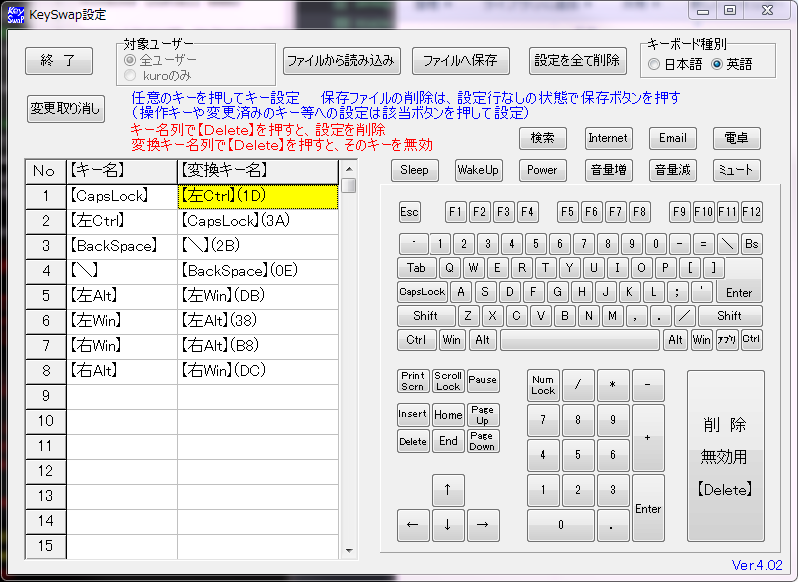

# Windows Provisioning

Windowsのセットアップメモ

mac mini にWindowsをBootcampでインストールした備忘録

## インストール

### Chocolatey を使ってインストール

https://chocolatey.org/ にあるコマンドを実行してインストール

[packages.config](packages.config) にまとめたのでこれからインストールできる。
初回は -y オプションをつけると楽かも（未確認）

```
cinst packages.config
```

インストールに失敗することもあるのでそのときは
コマンドプロンプトを管理者として実行する。

- executor: Alfred風のランチャ。追加したいときはショートカットなどを検索窓にD&D

### 普通にインストール

Chocolatey になかったり、失敗したり、古いものは手動でインストール

- Explzh http://www.ponsoftware.com/archiver/download.htm
  - 圧縮解凍
- Clover http://ejie.me/
  - タブ型のファイラ
- Everything http://www.forest.impress.co.jp/library/software/everything/
  - 高速にファイル名から検索できる
- PhraseExpress http://www.phraseexpress.com/
  - スニペットやクリップボード履歴


### マウススクロール

スクロールを逆方向にしたかったので下記URLを参考にして  
レジストリの「FlipFlopWheel」を1に変更した

- http://pc-karuma.net/boot-camp-windows-scroll-natural/
- http://marui.hatenablog.com/entry/20120505/1336196908


### キーバインド

- KeySwap for XP http://www.vector.co.jp/soft/winnt/util/se228667.html
  - 設定はこんな感じにした 

yamy http://rcmdnk.github.io/blog/2013/03/13/yamy/ を参考に
yamy.ini の escapeNLSKeys の値を 1にする
タスクスケジューラーに登録

Macっぽいキーバインドにしたいので [my.mayu](my.mayu) のような設定にした。

### apm install

[apm_packages.txt](apm_packages.txt) にまとめた
```
apm install --packages-file apm_packages.txt
```

### font

- http://myrica.estable.jp/myricahistry/
- https://github.com/yascentur/RictyDiminished
- https://github.com/adobe-fonts/source-han-code-jp
- http://www.google.com/get/noto/#sans-jpan
